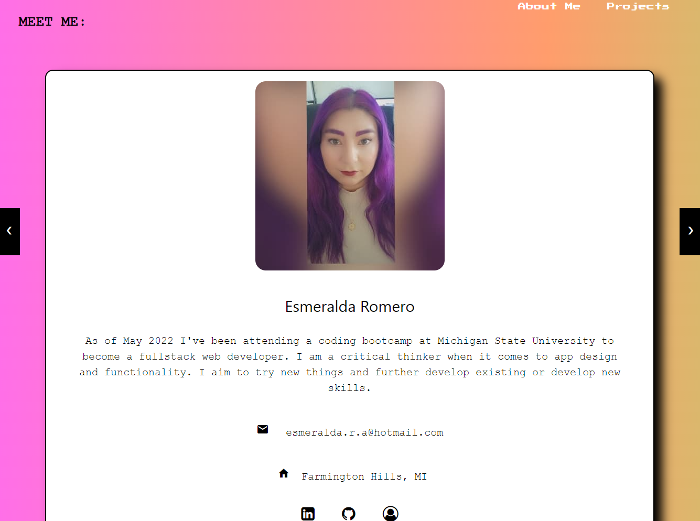

# Portfolio📜

## Description

A website that displays my contact information, skills and about me.

## Table of Contents

- [Images](#images)

- [Questions](#questions)

## Images

---

_display a little about me, contact info, Linkedin, GitHub and resume_

_You can go to the projects sections and view the Github and website of each project_

_You can click on the option on the header to take you to each section_

## Questions

---

[GitHub](https://github.com/)

[Portfolio](http://esmy101.com/)
